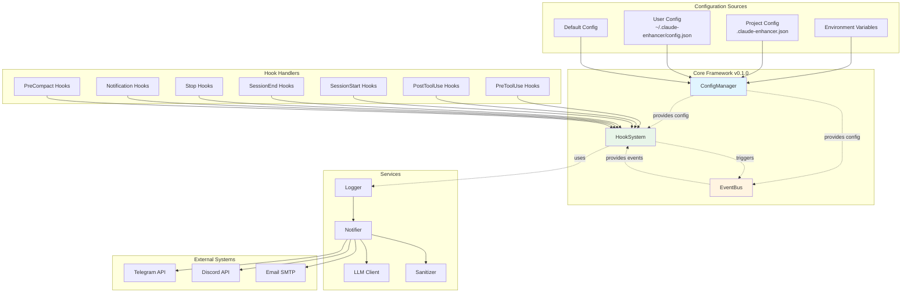
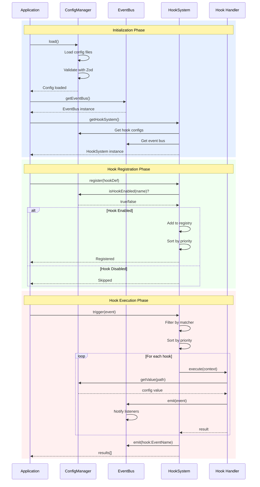
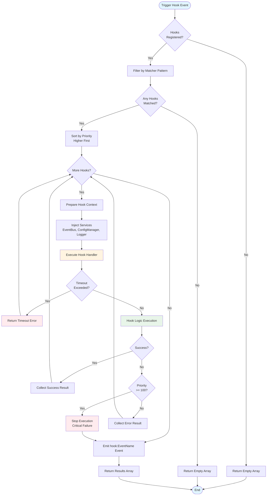
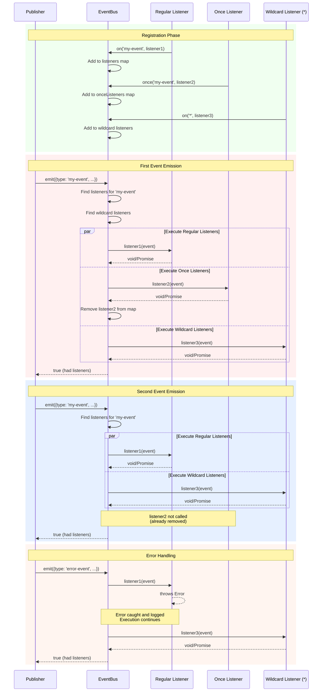
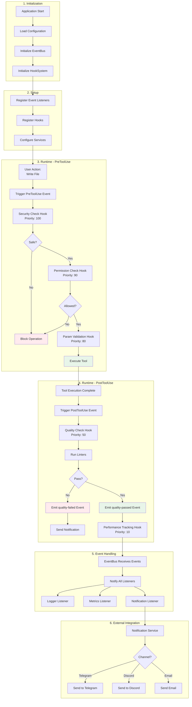
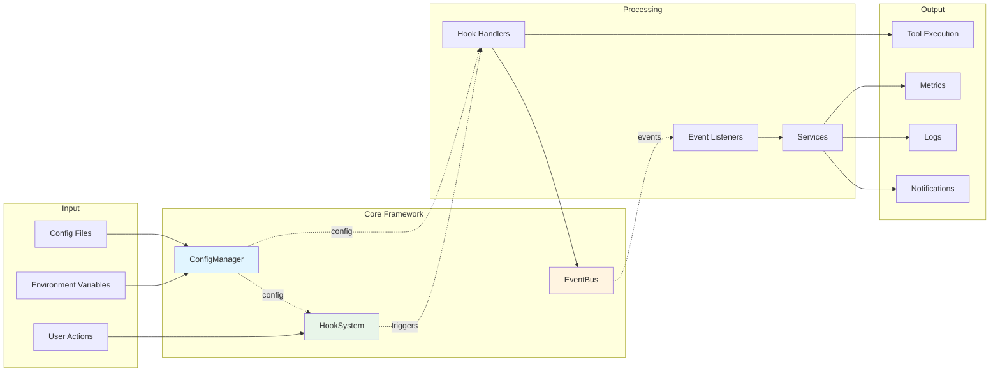

# Architecture Diagrams

This document provides visual representations of the Core Framework architecture using Mermaid diagrams.

## Table of Contents

- [Overall Architecture](#overall-architecture)
- [Component Interaction](#component-interaction)
- [Hook Execution Flow](#hook-execution-flow)
- [Configuration Loading Flow](#configuration-loading-flow)
- [Event Flow](#event-flow)

---

## Overall Architecture

High-level overview of the Core Framework components and their relationships.



---

## Component Interaction

Detailed view of how the three core components interact with each other.



---

## Hook Execution Flow

Detailed flow of hook execution from trigger to completion.



---

## Configuration Loading Flow

How configuration is loaded and merged from multiple sources.

```mermaid
flowchart TD
    Start([Start Config Loading]) --> InitDefault[Initialize with<br/>Default Config]

    InitDefault --> CheckUser{User Config<br/>Exists?}

    CheckUser -->|Yes| LoadUser[Load User Config<br/>~/.claude-enhancer/config.json]
    CheckUser -->|No| CheckProject

    LoadUser --> ParseUser[Parse JSON]
    ParseUser --> ResolveUserEnv[Resolve ${VAR} Placeholders]
    ResolveUserEnv --> MergeUser[Deep Merge with Default]

    MergeUser --> CheckProject{Project Config<br/>Exists?}
    CheckProject -->|Yes| LoadProject[Load Project Config<br/>./.claude-enhancer.json]
    CheckProject -->|No| ApplyEnvOverrides

    LoadProject --> ParseProject[Parse JSON]
    ParseProject --> ResolveProjectEnv[Resolve ${VAR} Placeholders]
    ResolveProjectEnv --> MergeProject[Deep Merge<br/>Higher Priority]

    MergeProject --> ApplyEnvOverrides[Apply Environment<br/>Variable Overrides<br/>CLAUDE_ENHANCER_*]

    ApplyEnvOverrides --> ValidateZod[Validate with<br/>Zod Schema]

    ValidateZod --> ValidationResult{Valid?}

    ValidationResult -->|Yes| StoreConfig[Store Final Config]
    ValidationResult -->|No| FormatErrors[Format Validation Errors]

    FormatErrors --> ThrowError[Throw Configuration Error]
    ThrowError --> End([End with Error])

    StoreConfig --> LogSuccess[Log Success]
    LogSuccess --> ReturnConfig[Return Config Object]
    ReturnConfig --> Success([End Successfully])

    style Start fill:#e1f5ff
    style Success fill:#e8f5e9
    style End fill:#ffebee
    style ValidateZod fill:#fff4e1
    style ThrowError fill:#ffebee
```

---

## Event Flow

How events flow through the EventBus system.



---

## Complete Workflow Example

End-to-end workflow showing all components working together.



---

## Data Flow Diagram

How data flows through the system from configuration to execution.



---

## Related Documentation

- [Getting Started Guide](./guides/getting-started.md)
- [API Reference](./api/README.md)
- [Architecture Design](../analysis/architecture-design-2025-01-12.md)
